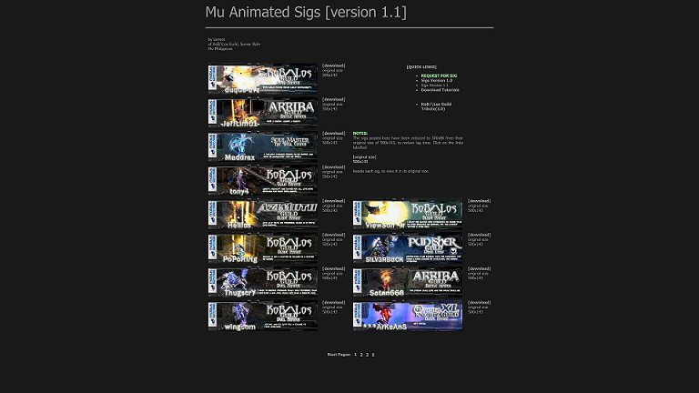

## sigs

This repository is a backup and archive of the Mu Online forums signatures request page, created on 2008-2009.

The original website was hosted on Google Sites, Free Webs, and Photobucket before the services shut down or changed their free hosting policies.

The animated GIFs and large reference graphics files are now hosted on Firebase Storage to save space on GitHub. The website retains references to original assets that are still available on Photobucket.

**NOTE:** The original site templates use static files and outdated HTML/JS approaches. Some functionality on various pages may not work on modern browsers.



## Demo

https://muonlineph.github.io/sigs/

## Assets and Related Files

- local-assets: [ [mirror 1](https://firebasestorage.googleapis.com/v0/b/weaponsforge-demo.appspot.com/o/sigs-request%2Flocal-assets.zip?alt=media&token=9c27b849-8eaa-4ad0-ad1b-e97a2a61f7e1) | [mirror 2](https://drive.google.com/drive/folders/1KdY_BEnuetJ4_Qc5GZcyrSe7oGueP9qC?usp=sharing) ]

### Content

- [Demo](#demo)
- [Assets and Related Files](#assets-and-related-files)
- [Content](#content)
- [Dependencies](#dependencies)
- [Installation](#installation)
- [Usage](#usage)


### Dependencies

This project has no dependencies since it only contains static website files. Other local web servers that allow the hosting of static files are alternate options for local host development.

- (Optional) Docker<br>
   Required to run a Dockerized Node web server for local development

## Installation

1. Clone this repository.<br>
`https://github.com/muonlineph/sigs.git`

2. Pull the local web server image (this requires Docker installed).<br>
`docker pull weaponsforge/livereload-basic:latest`

3. Download and extract the assets from [mirror1](https://firebasestorage.googleapis.com/v0/b/weaponsforge-demo.appspot.com/o/sigs-request%2Flocal-assets.zip?alt=media&token=9c27b849-8eaa-4ad0-ad1b-e97a2a61f7e1) or [mirror2](https://drive.google.com/drive/folders/1D3B-CRLR3iT8PJub1w6vwmqjV9sbxo6V?usp=sharing) for the following directories. These are required when working on `http://localhost:3000/offline/`.
   - /public/300x86
   - /public/downloads
   - /public/files


## Usage

1. Navigate to the project root directory using a terminal, then run the local web server.<br>
`docker run -it --rm -p 3000:3000 -v %cd%\public:/opt/app/public -e USE_POLLING=true weaponsforge/livereload-basic:latest`

2. Load the localhost website at:<br>
`http://localhost:3000`

3. Edit the existing static files from the **./public** directory and wait for live reload. Your updates will reflect on the web browser.
   - `http://localhost:3000/`
	    - Loads assets and media from online storage references on Photobucket and Firebase Storage
   - `http://localhost:3000/offline`
      - Loads assets and media from public local development environment references
      - Download the required files first for the following directories from the [mirror1](https://firebasestorage.googleapis.com/v0/b/weaponsforge-demo.appspot.com/o/sigs-request%2Flocal-assets.zip?alt=media&token=9c27b849-8eaa-4ad0-ad1b-e97a2a61f7e1) or [mirror2](https://drive.google.com/drive/folders/1D3B-CRLR3iT8PJub1w6vwmqjV9sbxo6V?usp=sharing) assets backup before proceeding:

         ```
         /public/300x86
         /public/downloads
         /public/files
         ```

3. To include new static website files on live reload:
	- Create new static (.html, .js, .css) files inside the **./public** directory.

@weaponsforge<br>
20211110<br>
20241008
